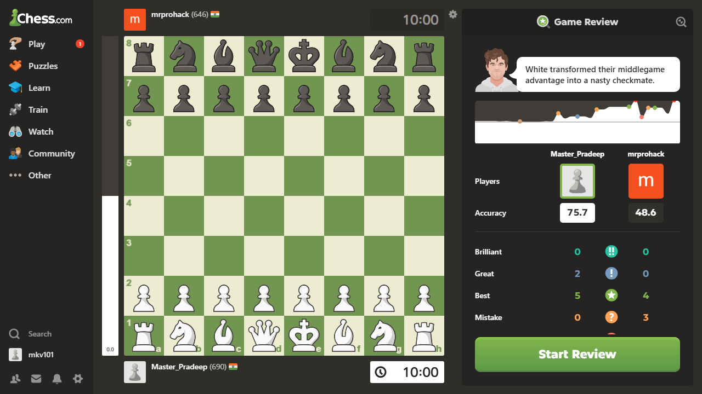

# ♟️ Chess Game Review Clone

A full-stack Chess.com game review clone that lets you paste any Chess.com game URL and instantly replay it move-by-move in a beautiful dark-mode UI.



---

## 🚀 Features

- **Paste & Analyze** — Paste any Chess.com live game URL and fetch the full game instantly
- **Step-by-Step Replay** — Navigate through every move with `⏮ ◀ ▶ ⏭` controls or click any move directly in the list
- **Custom Chess Board** — Pixel-perfect green-and-cream board with Unicode pieces, built from scratch (no library dependencies)
- **Player Info** — Displays player names and ratings fetched directly from the Chess.com API
- **Move List** — Full annotated move list with move quality badges (`!`, `?`, `!!`, `??`)
- **Dark Mode UI** — Chess.com-inspired dark theme with `#312E2B` background

---

## 🏗️ Project Structure

```
chesspgn/
├── chess-clone/          # React frontend (Vite)
│   └── src/
│       ├── App.jsx
│       ├── App.css
│       └── components/
│           ├── BoardArea.jsx     # Player info + chess board
│           ├── ChessBoard.jsx    # Custom FEN-based board renderer
│           ├── RightPanel.jsx    # Move list, URL input, controls
│           └── Sidebar.jsx
│
├── chess-backend/        # Python FastAPI backend
│   └── main.py           # /api/analyze endpoint
│
└── chess-review-scraper/ # Original scraping scripts & tools
```

---

## ⚙️ Tech Stack

| Layer     | Technology                          |
|-----------|-------------------------------------|
| Frontend  | React 19, Vite, Vanilla CSS         |
| Board     | Custom `ChessBoard.jsx` (FEN parser + Unicode pieces) |
| Backend   | Python, FastAPI, `python-chess`     |
| Data      | Chess.com Public API + Internal API |

---

## 🛠️ Setup & Running

### 1. Backend (FastAPI)

```bash
cd chess-backend

# Create and activate virtual environment
python -m venv venv
venv\Scripts\activate       # Windows
# source venv/bin/activate  # Mac/Linux

# Install dependencies
pip install fastapi uvicorn requests python-chess

# Start the API server
uvicorn main:app --port 8000 --reload
```

The backend will be available at **http://localhost:8000**

### 2. Frontend (React)

```bash
cd chess-clone

# Install dependencies
npm install

# Start dev server
npm run dev
```

The app will be available at **http://localhost:5173**

---

## 🎮 How to Use

1. Open **http://localhost:5173** in your browser
2. Copy any Chess.com live game URL, for example:
   ```
   https://www.chess.com/game/live/170804338698
   ```
3. Paste it in the input box at the top of the right panel
4. Click the green **Analyze** button
5. Use the `⏮ ◀ ▶ ⏭` buttons to step through moves, or click any move in the list

---

## 🔌 API Reference

### `POST /api/analyze`

Fetches and parses a Chess.com game by URL.

**Request Body:**
```json
{
  "url": "https://www.chess.com/game/live/170804338698"
}
```

**Response:**
```json
{
  "white": "mattgarza779",
  "black": "mkv101",
  "white_rating": 522,
  "black_rating": 537,
  "result": "0-1",
  "moves": [
    {
      "number": 1,
      "color": "white",
      "notation": "d4",
      "classification": "",
      "fen": "rnbqkbnr/pppppppp/8/8/3P4/8/PPP1PPPP/RNBQKBNR b KQkq - 0 1"
    }
  ]
}
```

---

## 📦 How it Works

```
User pastes URL
       │
       ▼
React Frontend (port 5173)
  POST /api/analyze  ──────────►  FastAPI Backend (port 8000)
                                        │
                                        ├─ Extract Game ID from URL
                                        ├─ Hit Chess.com /callback/live/game/{id}
                                        │   → Gets player names + game timestamp
                                        ├─ Hit Chess.com Public API
                                        │   → Gets official PGN for that month
                                        └─ Parse PGN with python-chess
                                            → Returns moves + FEN for each position
       ◄────────────────────────────────┘
React updates board + move list
```

---

## 🐛 Known Issues / Notes

- The Chess.com API occasionally rate-limits requests; if a game fails to load, try again after a few seconds
- The custom board uses Unicode chess pieces — no external image assets needed
- `node_modules/` and `venv/` are excluded from the repo; run `npm install` and `pip install` after cloning

---

## 📄 License

MIT — free to use and modify.
